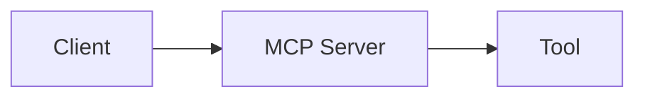

# Presentation

Slide decks built with [Marp](https://marp.app/), with Mermaid diagram support.

## Setup

```bash
npm install
```

## Usage

| Command | Description |
|---------|-------------|
| `npm run dev` | Live preview server at http://localhost:8080 |
| `npm run build` | Build all slides to `dist/` as HTML |
| `npm run build:pdf` | Build all slides to `dist/` as PDF |

## Writing Slides

Add `.md` files to `slides/`. Each file becomes its own presentation.

### Frontmatter

Every slide deck needs this at the top:

```markdown
---
marp: true
theme: default
paginate: true
---
```

Available themes: `default`, `gaia`, `uncover`

### Slide Separator

Use `---` to separate slides:

```markdown
# Slide 1

Content here

---

# Slide 2

More content
```

### Mermaid Diagrams

Use fenced code blocks with `mermaid`:

````markdown

````

Mermaid renders client-side in HTML output via CDN. For PDF output, diagrams are rendered via Chromium during the build.

Supported diagram types: flowchart, sequence, class, state, ER, Gantt, and more — see [Mermaid docs](https://mermaid.js.org/).

## How Mermaid Works

The custom engine in `engine.mjs` transforms ` ```mermaid ` fences into `<pre class="mermaid">` blocks and injects the Mermaid ESM script from jsDelivr. No extra tooling required.

## Directory Structure

```
presentation/
├── slides/          # Source slide decks (.md)
├── dist/            # Built output (gitignored)
├── themes/          # Custom Marp CSS themes (optional)
├── engine.mjs       # Custom Marp engine with Mermaid support
├── .marprc.yml      # Marp CLI configuration
└── package.json
```
