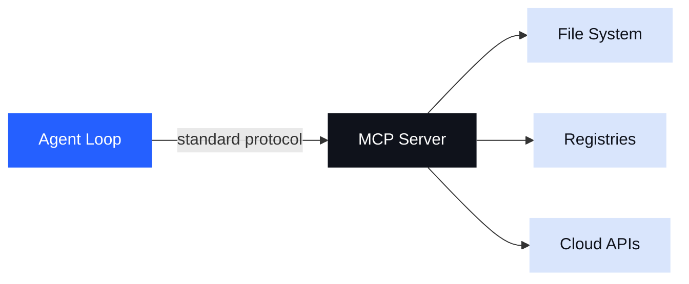
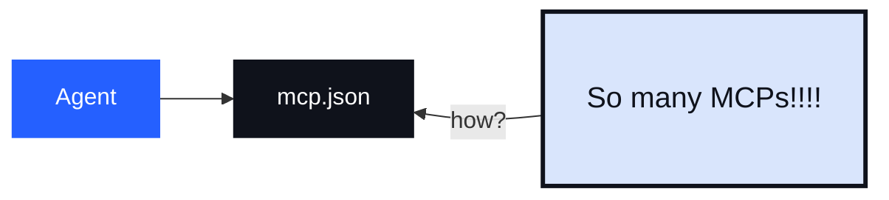
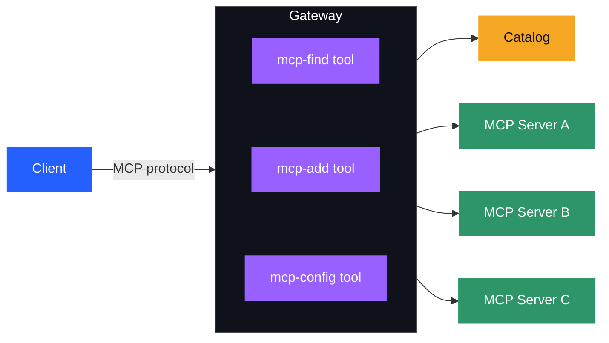
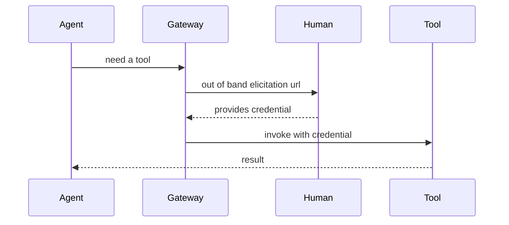
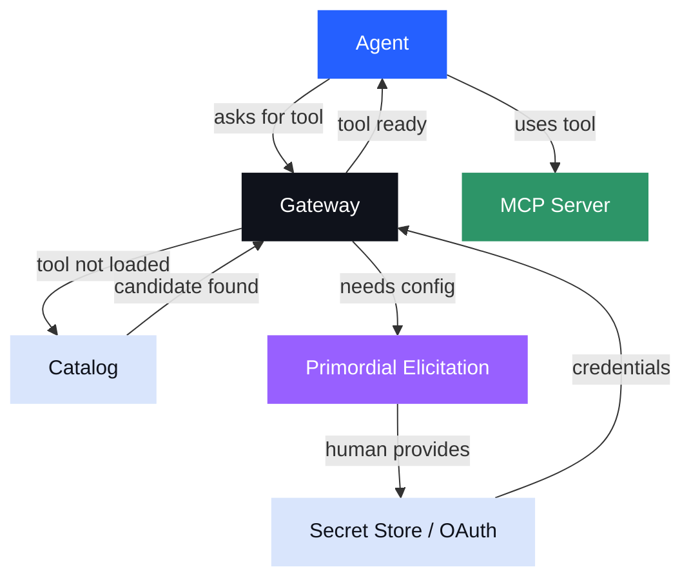
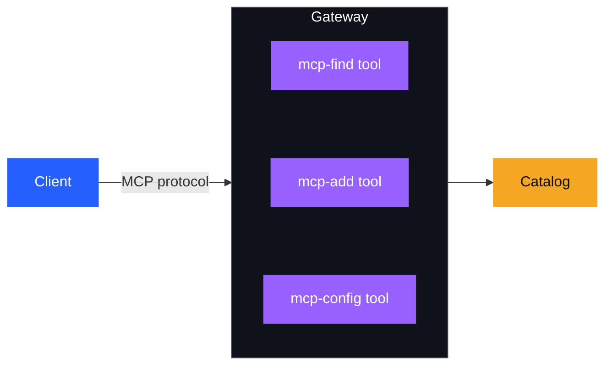
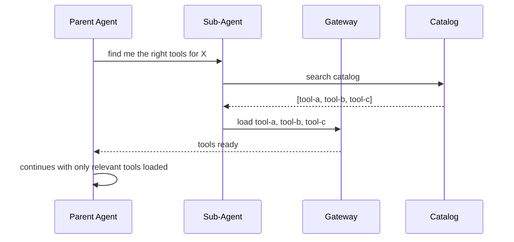

<!-- _class: lead -->

# Dynamic MCPs
## Jim Clark (neovim/spaces/nix-darwin)


> What happens when agents can choose, configure, and test their own MCP servers?

---

<!-- _class: section -->

# November 2024

## Number of MCP servers in the world:  ZERO

---

<style scoped>
pre { font-size: 0.55rem; }
</style>

Originally, I thought things were going to be very *skill-like.*

I was writing content like this:

```yaml
---
tools:
  name: curl
  description: use curl to download something
  image: docker.io/curl:latest   # ← any image from any registry
  args:
    - name: args
      description: the arguments to pass to curl
      type: array
      items: string
---

# Instructions

If you get asked to download something from the internet,
use this tool. If you need to understand more about curl,
just run `man curl` and read about it yourself!
```

---

Tools were **locked inside agent SDKs.**

To integrate, you had to wite an adapter **for each agent**.

```
LangChain / LangGraph  ──┐
AutoGen (Microsoft)    ──┤
CrewAI                 ──┼──  each one a walled garden
LlamaIndex             ──┤
Semantic Kernel        ──┘
```

December 2024 seems so long ago. There were so many different names for what was basically a _tool_. I barely remember any of it.

---

## MCP landed

MCP gave us the **standard interface** we were missing.



This is the power of a protocol. **We unlocked tools from the agents.**

LSP (language-service protocol) had previously un-tethered language ecosystems from editors, allowing developers to choose whatever editor they wanted to use.

---

<!-- _class: section -->

# Jan 2025

## Number of MCP servers in the world: 29

---

## Early Predictions (from me)

1. The tools agents need **already exist**
2. Agents will probably just read OpenAPI specs and use tools like curl to integrate apis.

Both wrong. We actually wrote a lot of new MCP servers.

> *MCP is how agents can access the tools and content that we already have.*

Sure, but I really thought we were going to _author_ far fewer servers.

---

<!-- _class: section -->

# Summer 2025

## Amassing catalogs — going remote, learning about OAuth

---

## Discovery

Last summer, we built a lot of **MCP servers.**

Many were local at first. Over time they became more and more remote. But there were starting to be a lot of them.




---

<!-- _class: section -->

# Gateways

## I blame nix, actually.

---

Two amazing concepts from dev environments

1. `nix(inputs) => environment` 
    - yes, we want my _reproducible_ tool environments
2. direnv — *where I am* should determine *what tools I need.*
    - I want my active MCP servers to be a function of what I'm doing

When MCP came along, it seemed useful to mirror these properties.

> An MCP gateway is like the output of an agent asking *what tools are relevant **here**?*

Also, container distribution and and docker runtimes seem like a good starting point.

*(By the way, does anyone remember [whalebrew](https://github.com/whalebrew/whalebrew)?)*

---

## What are the inputs

A catalog is a **bounded context** you can hand to an agent.

- The agent knows what's _available_
- We can _curate_
- It's a **governance boundary** — not a limitation, a contract

```
catalog
  ├── search-tool        (read: NPM registry)
  ├── build-tool         (write: local filesystem)
  ├── test-runner        (exec: sandboxed)
  └── publish-tool       (write: registry, requires auth)
```

The catalog says: *the agent can do these things — and nothing else.*

---

## The mcp.json Factory

In practice, an agent's `mcp.json` is a defacto **factory.** for giving the agent access to stuff.

In that sense, we all use MCP gateways today — they just happen to be embedded in our clients.

However, it has always felt weird that we _leave_ our agents in order to **configure** our MCPs.

> *I'm supposed to stop what I'm doing, leave the agent, configure the MCPs I need, and then come back and continue what I was doing?*

Agents can help us with:

- config
- secrets
- authorization
- installing software

---

<!-- _class: section -->

# Primordial Tools

## tools for managing your MCPs

---

## Primordial tools



---

## mcp-find, mcp-add, mcp-config

The gateway can offer a **baseline set of tools** — always available:

- `mcp-find` — searches your catalog
  - does not alter the MCP session
  - Returns metadata about required configuration
    - will it need an API key? Will it require an oauth flow. Does it have requird config? 
  - Importing metadata from the Community registry is great here!
- `mcp-add` — Add the server to my session. 
    - If you can't add it, **explain why**
    - this alters the current MCP session - raises changes notifications
- `mcp-config` — Take input from the agent.
    - let the agent try to configure the MCP

---

## Primordial Elicitations



---

## Elicitations

*[demo: gateway eliciting configuration to get started with an MCP server]*



---

<!-- _class: section -->

# Start With Nothing

## Let the agent help you get started

---

## The Beauty of an Empty Session

The beauty of starting with nothing:

> *Let the agent help you figure this out*

The agent uses primordial tools to discover what it needs — and loads it.

### Memory

After building up a set of MCP servers, how do we _recall_ this configuration.

My favorite approach is to _name_ the session so that I can recall it from `Agents.md`.

| Primordial Tool | Purpose |
|----------------|---------|
| `mcp-session-save` | Persists the current MCP configuration; optionally pushes to an OCI registry |
| `mcp-session-activate` | Reconstitutes a saved session and raises change notifications |

---

## MCP Zen



> Use this catalog to help me solve a problem

---

<!-- _class: section -->

# Context

## We can't just keep adding MCPs

---

## The Context Problem

From an MCP perspective, we've just got a list of tools.
But there's a lot agents can do with this.

Giving an agent 200 tools means 200 tool descriptions in every prompt — most of them irrelevant to the task at hand.

Two patterns solve this:

1. **Deferred tool loading** — load tools on demand
2. **Sub-agents that build tool profiles** — compress tool space before handing off to the parent

---

## Deferred Tool Loading



Dynamic MCPs let agents **load exactly what they need, when they need it** — and nothing more.

---

## Sub-Agents That Build Profiles

Sub-agents can **compress a large tool space into a single higher-level tool.**

```
sub-agent knows about: [npm, build, test, lint, publish]
sub-agent produces: one "release" tool

parent agent context:
  ├── release-tool   ← produced by sub-agent (orchestrates 5 tools via code)
  └── (nothing else needed)
```

The parent agent never sees the underlying tools.
The sub-agent encoded that knowledge **into code**, not into the context window.

This is tool-space compression via code-mode style workflows.

---

<!-- _class: section -->

# Code Mode

## The foundry where tools are made

---

## The Foundry Use Case

What if an agent is **building a new tool** — not just using one?

The agent needs to:

1. Write the tool implementation
2. **Load it into a live MCP session**
3. Call it, observe the result
4. Iterate

This requires a sandbox that can **dynamically load code under construction.**

Static MCP configs can't do this. A dynamic MCP session can.

> The foundry is where tools are made. Agents need a foundry.

---

<!-- _class: dark -->

## Turning Agents on Themselves

We now have two foundational pieces in place:

**Universal runtimes** — any MCP server can run anywhere, consistently.

**Catalogs** — a governed, bounded set of tools an agent can use.

With these in place, we can ask a question we couldn't ask before:

> *"Can you use this catalog to help me solve a problem — including finding and loading the right tools for that problem?"*

The agent is no longer a consumer of a fixed tool set.
It becomes a **participant in assembling its own context.**

---

<!-- _class: section -->

# One Last Tool

## `mcp-catalog-add`

---

## Closing the Loop

`mcp-catalog-add` — update a catalog with a new tool.

The agent:
1. Uses the foundry to **build** a new tool
2. Tests it in a live session
3. **Publishes it back** to the catalog

```
build → test → catalog
```

The catalog grows. The next agent gets a better starting point.

> This is how tool ecosystems evolve — not by humans wrapping packages one at a time, but by agents turning themselves on the problem.

---

<!-- _class: lead -->

# Universal Runtimes + Catalogs

The two lynchpins that make agents truly dynamic.

**Catalogs** bound what agents can do.
**Runtimes** make any tool runnable, anywhere.
**Gateways** handle the human-in-the-middle flows.

*The loop is closed.*
