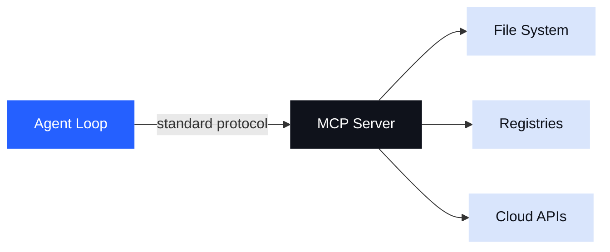
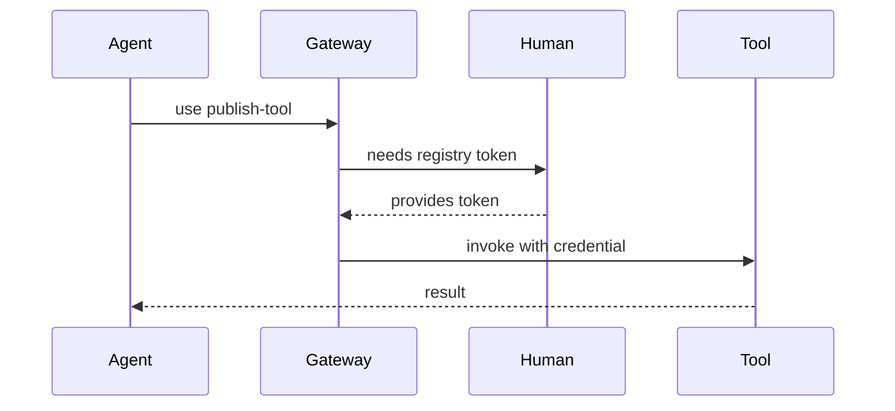
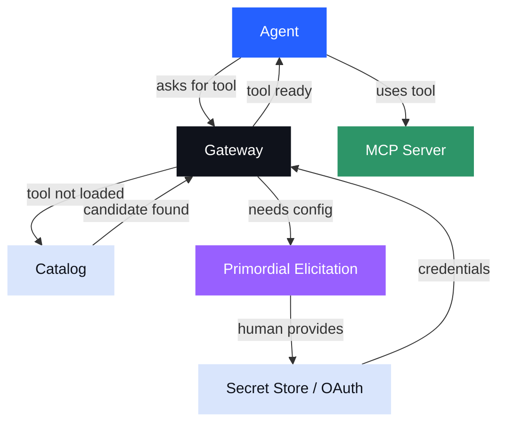

<!-- _class: lead -->

# Dynamic MCPs
### Turning Agents on Themselves

> What happens when agents can choose, configure, and test their own tools?

---

<!-- _class: section -->

# The Problem with Static Tools

## Agents wait while humans fetch

---

## MCPs Have Always Been Static

Today, an MCP server is something you configure **before** the conversation starts.

- You decide which tools the agent gets
- You register them in a config file
- You restart, reload, or re-prompt
- **The agent waits**

When you need a new capability, you leave the agent, do an out-of-band process, come back, and hope context survived.

> This is the same problem as static libraries in a world that needs dynamic linking.

---

<!-- _class: section -->

# A Brief History

## Skills → Tools → Sandboxes → MCP

---

## We Started with Skills

The first insight: **agents need reusable, composable capabilities.**

We called them *skills* — pre-packaged behaviors an agent could invoke.

But skills need **tools** to do real work.
Tools need **sandboxes** to run safely.

```
skill
  └── tool (what does the work)
        └── sandbox (where it runs safely)
```

Early attempts stalled on one missing piece: **no standard way for agent loops to interact with tools.**

---

## MCP Changed Everything

MCP gave us the **standard interface** we were missing.



Suddenly, the glue between agent loops and external tools was solved.
The problem shifted: **which tools, and how do you manage them?**

---

<!-- _class: section -->

# Catalogs

## A bounded context for tools

---

## The Catalog Problem

Once you have MCP, the next question is: **how do you get tools into it?**

We had thousands of useful npm packages. Getting them into an MCP catalog meant:

- Wrapping each package as an MCP server
- Testing that the wrapper actually worked
- Doing this reliably, at scale, without humans in the loop for every one

> *This is what forced the question of dynamic MCPs.*

If an agent could **spin up a candidate tool, test it, and validate it** — catalog building becomes an agent task, not a human task.

---

## What Makes a Catalog Powerful

A catalog is a **bounded context** you can hand to an agent.

- The agent knows exactly what it can do
- You know exactly what the agent can do
- It's a **governance boundary** — not a limitation, a contract

```
catalog
  ├── search-tool        (read: NPM registry)
  ├── build-tool         (write: local filesystem)
  ├── test-runner        (exec: sandboxed)
  └── publish-tool       (write: registry, requires auth)
```

The catalog says: *the agent can do these things — and nothing else.*

---

## The Hard Part: Configuration

Individual tools in a catalog often need **configuration, authentication, or authorization**.

- API keys, tokens, registry credentials
- Agents can sometimes share config **within a session scope**
- But acquiring that config is still a human-in-the-middle problem



---

<!-- _class: section -->

# Why Dynamic MCPs?

## Three motivations

---

## Motivation 1: Context Management

Static tool lists blow up your context window.

Giving an agent 200 tools means 200 tool descriptions sitting in every prompt — most of them irrelevant to the task at hand.

**The sub-agent pattern:**

```
parent agent (small context, focused tools)
    └── sub-agent: "find me the right tools for X"
          └── searches catalog
          └── returns: [tool-a, tool-b, tool-c]
    └── parent continues with only the relevant tools loaded
```

Dynamic MCPs let agents **load exactly what they need, when they need it** — and nothing more.

---

## Motivation 2: The Foundry Use Case

What if an agent is **building a new tool** — not just using one?

The agent needs to:

1. Write the tool implementation
2. **Load it into a live MCP session**
3. Call it, observe the result
4. Iterate

This requires a sandbox that can **dynamically load code under construction.**
Static MCP configs can't do this. A dynamic MCP session can.

> The foundry is where tools are made. Agents need a foundry.

---

## Motivation 3: Tool Space Compression

Sub-agents can **compress a large tool space into a single higher-level tool.**

```
sub-agent knows about: [npm, build, test, lint, publish]
sub-agent produces: one "release" tool

parent agent context:
  ├── release-tool   ← produced by sub-agent (orchestrates 5 tools via code)
  └── (nothing else needed)
```

The parent agent never sees the underlying tools.
The sub-agent encoded that knowledge **into code**, not into the context window.

This is tool-space compression via code-mode style workflows.

---

<!-- _class: dark -->

## Turning Agents on Themselves

We now have two foundational pieces in place:

**Universal runtimes** — any MCP server can run anywhere, consistently.

**Catalogs** — a governed, bounded set of tools an agent can use.

With these in place, we can ask a question we couldn't ask before:

> *"Can you use this catalog to help me solve a problem — including finding and loading the right tools for that problem?"*

The agent is no longer a consumer of a fixed tool set.
It becomes a **participant in assembling its own context.**

---

<!-- _class: section -->

# The Gateway

## Primordial tools for a dynamic world

---

## The Last Hard Problem: Configuration at Runtime

Dynamic tool loading surfaces an old problem in a new context.

When an agent dynamically adds an MCP server, it needs to:

- Know what configuration the server requires
- Collect secrets or credentials
- Handle OAuth flows or token exchange

This is where a **gateway** becomes more than a router.

The gateway can offer **primordial tools** — a baseline set of capabilities that exist before any catalog is loaded:

| Primordial Tool | Purpose |
|----------------|---------|
| `elicit_config` | Walk user through required fields |
| `resolve_secret` | Fetch from local credential store |
| `authorize` | Trigger OAuth / token flow |

---

## The Full Picture



---

<!-- _class: lead -->

# Universal Runtimes + Catalogs

The two lynchpins that make agents truly dynamic.

**Catalogs** bound what agents can do.
**Runtimes** make any tool runnable, anywhere.
**Gateways** handle the human-in-the-middle flows.

*The loop is closed.*
