<!-- _class: lead -->

# Dynamic MCPs
## Jim Clark (neovim/spaces/nix-darwin)

> What happens when agents can configure their own MCP servers?

---

## Note on slide preparation

- dictate talk
- give claude code two MCPs
    - mermaid (for diagrams)
    - marp (for presentation)
- > "build companion slides"
- > "copy styles out of this powerpoint template"
- read through slide deck and iterate
- [push to GitHub](https://github.com/slimslenderslacks/presentations/tree/main/slides/dynamic-mcps.md)

---

<!-- _class: section -->

# November 2024

## Number of MCP servers in the world:  ZERO

---

<style scoped>
pre { font-size: 0.70rem; }
</style>

Me: thought things were going to _start_ very *skill-like.*

At the time, I was writing content like this (prompts _select_ tools - tools are containers)

```yaml
---
tools:
  name: curl
  description: use curl to download something
  image: docker.io/curl:latest   # ← any image from any registry
  args:
    - name: args
      description: the arguments to pass to curl
      type: array
      items: string
---

# Instructions

If you get asked to download something from the internet,
use this tool. If you need to understand more about curl,
just run `man curl` and read about it yourself!
```

---

Tools were **locked inside agent SDKs.**

To integrate, you had to wite an adapter **for each agent**.

```
LangChain / LangGraph  ──┐
AutoGen (Microsoft)    ──┤
CrewAI                 ──┼──  each one a walled garden
LlamaIndex             ──┤
Semantic Kernel        ──┘
```

Tools were called so many different things.  It was brutal. Fortunately, I barely remember any of it.

---

## MCP landed

MCP gave us the **standard interface** we were missing.

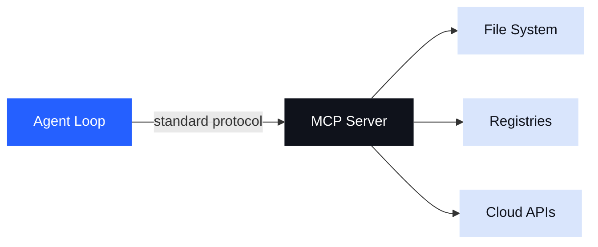

This is the power of a protocol. **We unlocked tools from the agents.**

LSP (language-service protocol) had previously un-tethered language ecosystems from editors. Languages stopped forcing editors on us.

---

<!-- _class: section -->

# Jan 2025

## Number of MCP servers in the world: 29

---

## Early Predictions (from me)

1. The tools we need **are already here**
2. Calling APIs: probably just access to OpenAPI specs and tools like curl?

Wrong. 

We _hand_ wrote a lot of MCP servers.

> *MCP is how agents can access the tools and content that we already have.*

Sure, but I really thought we were going to _author_ far fewer servers.

---

<!-- _class: section -->

# Summer 2025

## Amassing catalogs — going remote, learning about OAuth

---

## Discovery

Last summer, we built a lot of **MCP servers.**

Many were local at first. Over time they became more and more remote. It looked like there were going to be a lot of them.

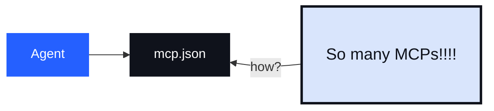

---

## The mcp.json Factory

In practice, an agent's `mcp.json` is a defacto **factory** for the client's _gateway_ to MCP

However, it has always felt weird that it has felt like we have to _leave_ our agents in order to **configure** our MCPs.

> *I'm supposed to stop what I'm doing, leave the agent, configure the MCPs I need, and then come back and continue what I was doing?*

These things are not easy and I can't use an agent to do them?

- config
- secrets
- authorization
- installing software

---

<!-- _class: section -->

# Gateways

## I blame nix, actually.

---

Two concepts from years obsessing about dev environments

1. `nix(inputs) => environment` 
    - your environment (eg your productivity) is the output of a function
    - we really do want my _reproducible_ tool environments
2. direnv — *where I am* determines *what tools I need.*
    - I want my active MCP servers to be a function of what I'm doing
    - location!!!

When MCP came along, it seemed useful to mirror these properties.

> An MCP gateway should provides tools that are relevant **here**

In the end, docker can be summarized with two words (_pull_ and _run_)

*(By the way, does anyone remember [whalebrew](https://github.com/whalebrew/whalebrew)?)*

---

## What are the inputs

A catalog is a **bounded context** you can hand to an agent.

- The agent knows what's _available_
- We need something that can be _curated_ (trusted)
- It's a **governance boundary** — not a limitation, a contract
- A catalog does not have to be _small_. It just has to be safe.

```
catalog
  ├── search-tool        (read: NPM registry)
  ├── build-tool         (write: local filesystem)
  ├── test-runner        (exec: sandboxed)
  └── publish-tool       (write: registry, requires auth)
```

The catalog says: *the agent can do these things — and nothing else.*

---

<!-- _class: section -->

# Primordial Tools

## tools for managing your MCPs

---

## Primordial tools

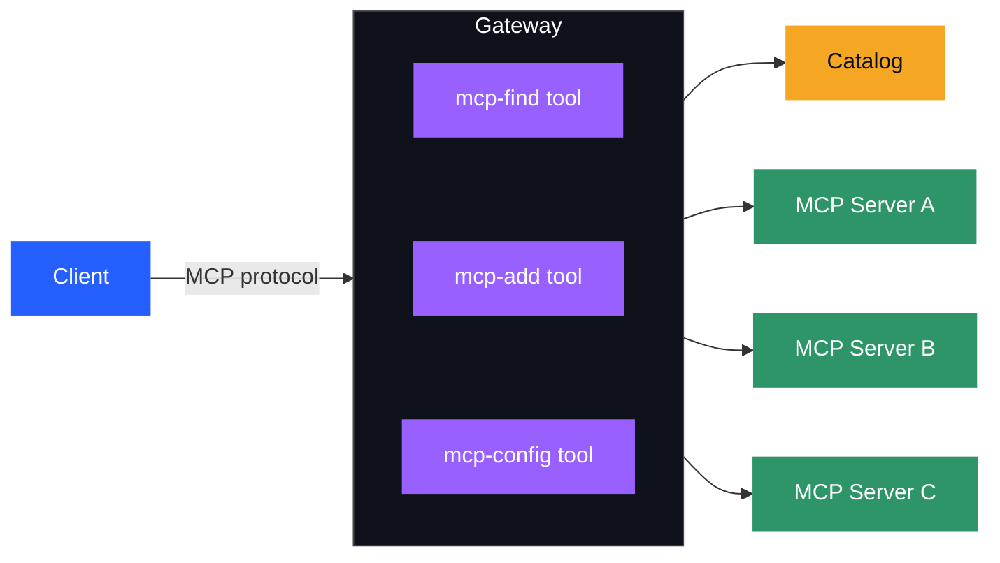

---

## mcp-find, mcp-add, mcp-config

The gateway can offer a **baseline set of tools** — always available:

- `mcp-find` — searches your catalog
  - does not alter the MCP session
  - Returns metadata about required configuration
    - will it need an API key? Will it require an oauth flow. Does it have requird config? 
  - Importing metadata from the Community registry is great here!
- `mcp-add` — Add the server to my session. 
    - If you can't add it, **explain why**
    - this alters the current MCP session - raises changes notifications
- `mcp-config` — Take input from the agent.
    - let the agent try to configure the MCP

---

<!-- _class: section -->

# Start With Nothing

## Let the agent help you get started

---

## The Beauty of an Empty Session

Connect to a clean slate (just primordial tools)

*Let the agent do the work for you*

Use context to discover what tools that are needed.

---

## MCP Zen

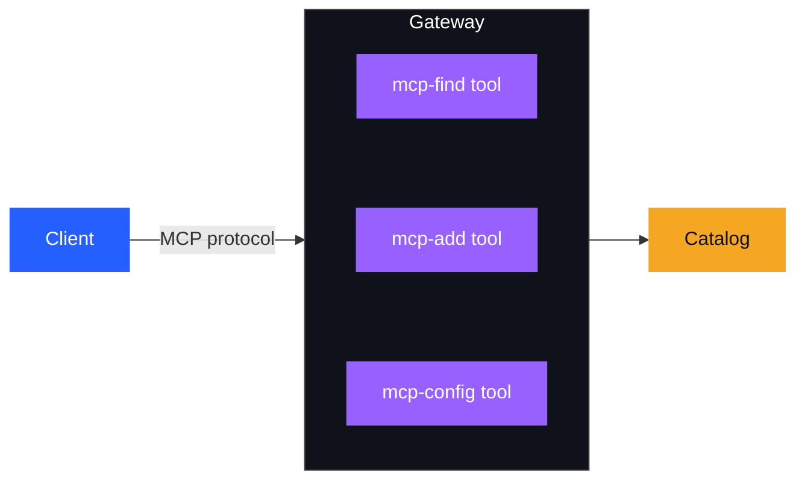

> Use this catalog to help me solve a problem

---

<div style="display:flex;justify-content:center;align-items:center;height:100%">

</div>

<script>
(function() {
  const GIF_DURATION_MS = 8000; // adjust to match actual gif length
  const img = document.getElementById('logseq-gif');
  const section = img.closest('section');
  let timer;

  new MutationObserver(() => {
    if (section.classList.contains('bespoke-active')) {
      // restart gif
      img.style.display = 'block';
      img.src = '';
      img.src = 'logseq.gif';
      clearTimeout(timer);
      // freeze on last frame after one loop
      timer = setTimeout(() => {
        const canvas = document.createElement('canvas');
        canvas.width = img.naturalWidth || img.width;
        canvas.height = img.naturalHeight || img.height;
        canvas.style.cssText = img.style.cssText;
        canvas.getContext('2d').drawImage(img, 0, 0, canvas.width, canvas.height);
        img.src = '';
        img.parentNode.replaceChild(canvas, img);
      }, GIF_DURATION_MS);
    }
  }).observe(section, { attributes: true, attributeFilter: ['class'] });
})();
</script>

---

### Memory

After building up a set of MCP servers, how do we _recall_ this configuration.

My favorite approach is to _name_ the session so that I can recall it from `Agents.md`.

| Primordial Tool | Purpose |
|----------------|---------|
| `mcp-session-save` | Persists the current MCP configuration; optionally pushes to an OCI registry |
| `mcp-session-activate` | Reconstitutes a saved session and raises change notifications |

---

## Primordial Elicitations

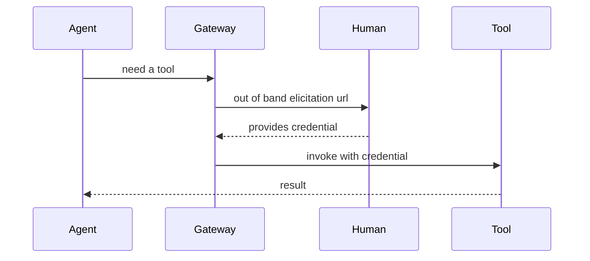

---

## Elicitations


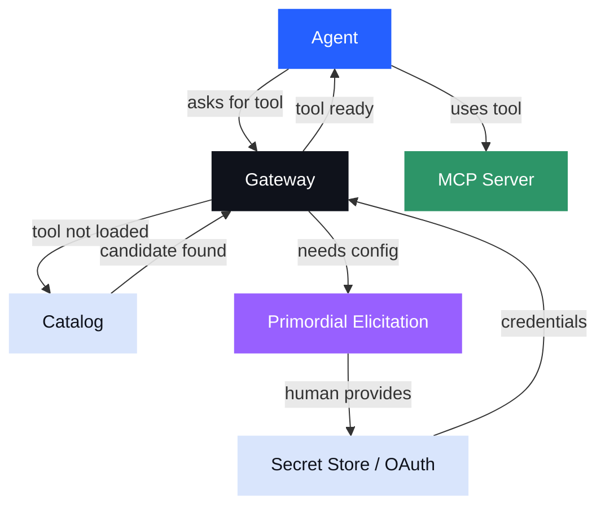
---

<div style="display:flex;justify-content:center;align-items:center;height:100%">

</div>

<script>
(function() {
  const GIF_DURATION_MS = 8000; // adjust to match actual gif length
  const img = document.getElementById('goose-gif');
  const section = img.closest('section');
  let timer;

  new MutationObserver(() => {
    if (section.classList.contains('bespoke-active')) {
      img.style.display = 'block';
      img.src = '';
      img.src = 'goose.gif';
      clearTimeout(timer);
      timer = setTimeout(() => {
        const canvas = document.createElement('canvas');
        canvas.width = img.naturalWidth || img.width;
        canvas.height = img.naturalHeight || img.height;
        canvas.style.cssText = img.style.cssText;
        canvas.getContext('2d').drawImage(img, 0, 0, canvas.width, canvas.height);
        img.src = '';
        img.parentNode.replaceChild(canvas, img);
      }, GIF_DURATION_MS);
    }
  }).observe(section, { attributes: true, attributeFilter: ['class'] });
})();
</script>

---

<!-- _class: section -->

# Context

## How was this ever MCP's fault?

---

## The Context Problem

The job of the MCP server was to provide tools that might be useful. It actually doesn't say anything about how to add them to an agent conversation.

We see a lot of complaints about MCP that read like this:

> Giving an agent 200 tools means 200 tool descriptions in every prompt — most of them irrelevant to the task at hand!

We are coming up with new ways to handle this.

1. **Deferred tools** — model-driven tool loading on demand
2. **Sub-agents create MCP profiles** — child agent creates an MCP session for the parent agent to use
3. **Code Mode** - compress tool space from N tools into one agent-facing tool

---

## Deferred Tools

Anthropic invented the idea of a _deferred_ tool.

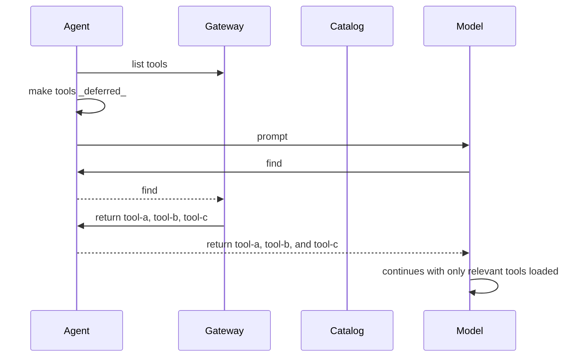

I only understood the value of this once I understood that they could preserve the prompt cache.

---

## Sub-Agent Tool Loading

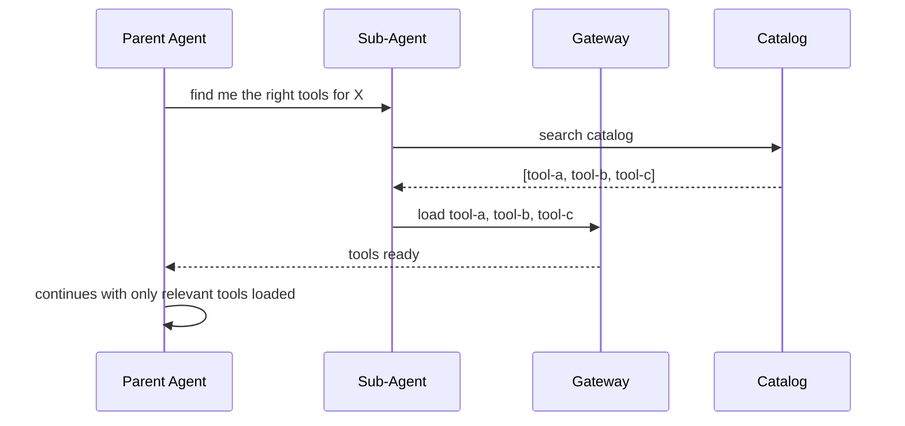

MCPs let agents **load exactly what they need, when they need it** — and nothing more.

---

<!-- _class: section -->

# Agents will code

## Tool foundries

---

## Tool Compression 

**compress a large tool space into a single higher-level tool.**

```
sub-agent knows about: [npm, build, test, lint, publish]
sub-agent produces: one "release" tool

parent agent context:
  ├── release-tool   ← produced by sub-agent (orchestrates 5 tools via code)
  └── (nothing else needed)
```

The parent agent sees a higher level of abstraction
The sub-agent encodes knowledge into a tool, not into the context window.

This is an importan property of code-mode style workflows.

---

## Code mode

> Create a new MCP tool that knows how _directly_ call other MCPs

- we have implemented this as another primordial gateway tool called `code-mode`
- only the code mode tool added to context

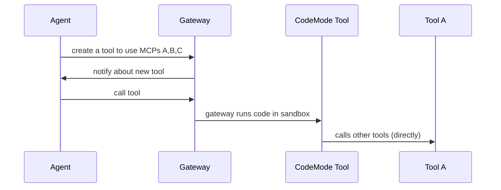

---

## Code mode sandboxes

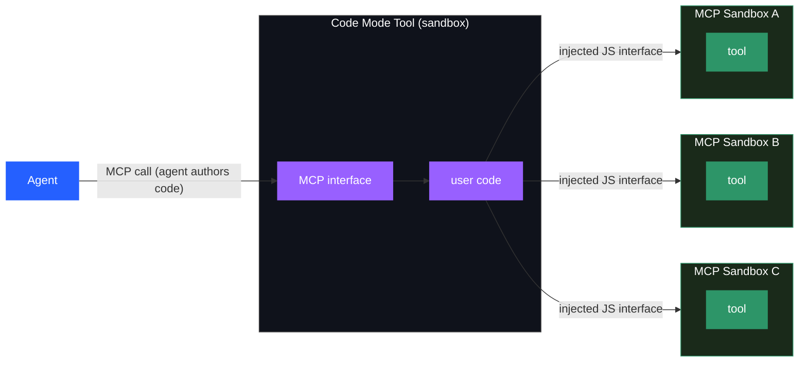

* credentials and authorizations remain with their original MCP server sandboxes

---

<div style="display:flex;justify-content:center;align-items:center;height:100%">

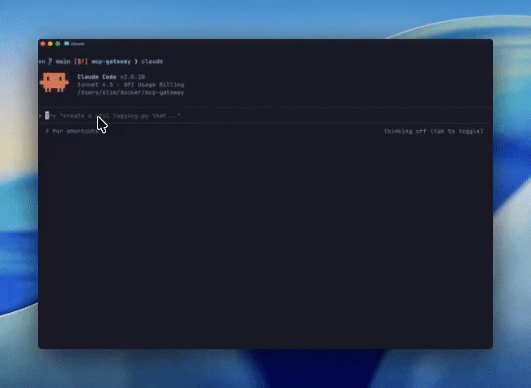

</div>

---

## The Foundry Use Case

What if an agent is **building a new tool** — not just using one?

The agent needs to:

1. Write the tool implementation
2. **Load it into a live MCP session**
3. Call it, observe the result
4. Iterate

This also requires a sandbox that can **dynamically load code under construction.**

To an agent skill, this looks like `mcp-add` on a new catalog item.

---

<!-- _class: dark -->

## Agents exploring the MCP space

We now have two foundational pieces in place:

**Sandboxed runtimes** — MCP servers in the catalog can request their own configuration

**Catalogs** — a governed, bounded set of tools an agent can use.

With these in place, we can ask a question we couldn't ask before:

> *"Can you use this catalog to help me solve a problem?"*

The agent is no longer a consumer of a fixed tool set.

Limited **participation** in assembling its own context.

---

<!-- _class: section -->

# One Last Primordial Tool

## `mcp-catalog-add`

---

## Closing the Loop

`mcp-catalog-add` — update a catalog with a new tool.

The agent:
1. Uses the foundry to **build** a new tool
2. Tests it in a live session
3. **Publishes it back** to the catalog

```
build → test → catalog
```

The catalog grows. The next agent gets a different starting point.

> This is how tool ecosystems might evolve — letting agents iterate on the problem with catalogs as outputs.

---

## Primordial Summary

| Primordial Tool | Confidence | Purpose |
|----------------|---------|--------------|
| `mcp-find` | high | Find MCP servers from your catalog |
| `mcp-add` | high | build an MCP activation loop with your agent |
| `mcp-config-set` | high | build an MCP activation loop with your agent |
| `mcp-session-save` | medium | Persists the current MCP configuration; optionally pushes to an OCI registry |
| `mcp-session-activate` | medium | Reconstitutes a saved session and raises change notifications |
| `code-mode` | medium | build a new tool |
| `mcp-exec` | low | working around missing notificiations |
| `mcp-catalog-add` | low | still red-teaming some of these loops |

---

<!-- _class: lead -->

# Sandboxed Runtimes + Catalogs

The three lynchpins for dynamic MCPs

**Catalogs** bound what agents can do.
**Sandboxed Runtimes** are _safe_ runtimes
**MCP Gateway** the agent's gateway to context

*The loop is closed.*
