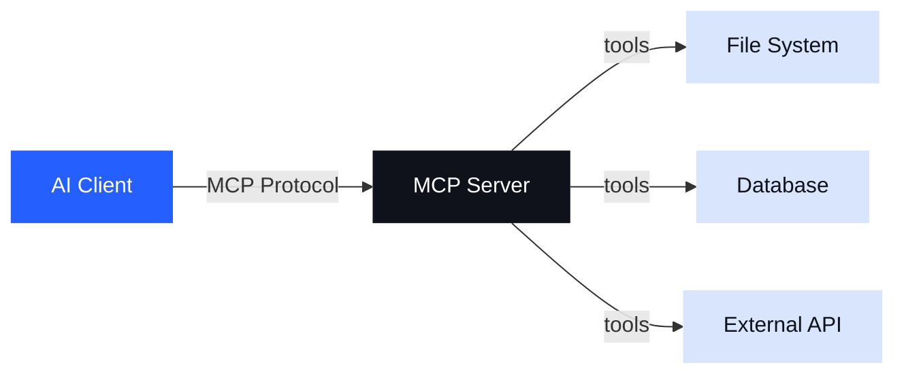
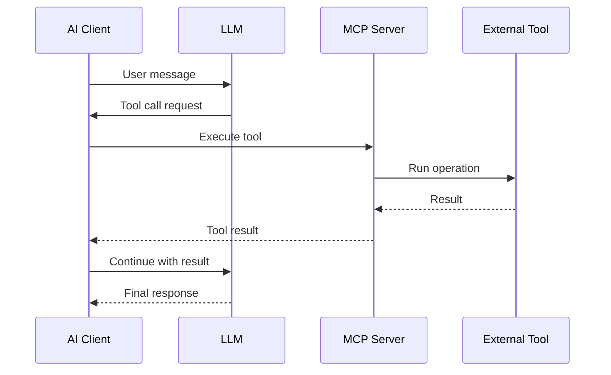

<!-- _class: lead -->

# Building with MCP
### Model Context Protocol — From Zero to Integration

> A practical guide to connecting AI models with the real world

---

## What is MCP?

**Model Context Protocol** is an open standard that lets AI models communicate with external tools and data sources.

- Standardized protocol between AI models and tools
- Replaces ad-hoc integrations with a common interface
- Supports **tools**, **resources**, and **prompts**
- Works with Claude and other LLM clients

---

<!-- _class: section -->

# The Problem Before MCP

## Why we needed a standard

---

## The Problem Before MCP

Without MCP, every integration is custom:

```
AI Model ──── custom code ──── Tool A
          ├── custom code ──── Tool B
          └── custom code ──── Tool C
```

**Problems with this approach:**
- Duplicated effort across teams and projects
- No portability between different AI models
- Hard to compose, audit, or secure
- Every integration reinvents the wheel

---

<!-- _class: section -->

# MCP Architecture

## How the pieces fit together

---

## MCP Architecture



---

## MCP Components

| Component | Description | Direction |
|-----------|-------------|-----------|
| **Tools** | Functions the model can call | Model → Server |
| **Resources** | Data the model can read | Server → Model |
| **Prompts** | Reusable prompt templates | Server → Model |
| **Sampling** | Model requests back to client | Server → Client |

---

## Tool Call Flow



---

## Writing an MCP Server

```typescript
import { Server } from '@modelcontextprotocol/sdk/server/index.js'
import { StdioServerTransport } from '@modelcontextprotocol/sdk/server/stdio.js'

const server = new Server({ name: 'my-server', version: '1.0.0' })

server.setRequestHandler(ListToolsRequestSchema, async () => ({
  tools: [{
    name: 'get_weather',
    description: 'Get current weather for a city',
    inputSchema: {
      type: 'object',
      properties: { city: { type: 'string' } },
      required: ['city']
    }
  }]
}))

const transport = new StdioServerTransport()
await server.connect(transport)
```

---

<!-- _class: dark -->

## Why Docker + MCP?

- **Portable** — ship your MCP server as a container
- **Isolated** — tools run with scoped permissions
- **Composable** — mix and match servers via Docker Compose
- **Secure** — no host access without explicit mounts

```bash
docker run --rm -p 3000:3000 my-org/mcp-server
```

---

## Key Takeaways

1. **Standardization** — one protocol, many tools
2. **Composability** — mix and match MCP servers
3. **Security** — explicit permissions per tool
4. **Portability** — works across AI clients

---

<!-- _class: lead -->

# Get Started

```bash
npm install @modelcontextprotocol/sdk
```

**modelcontextprotocol.io**
